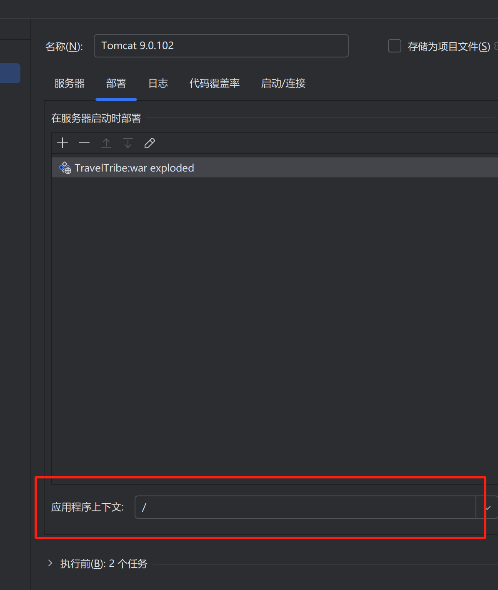
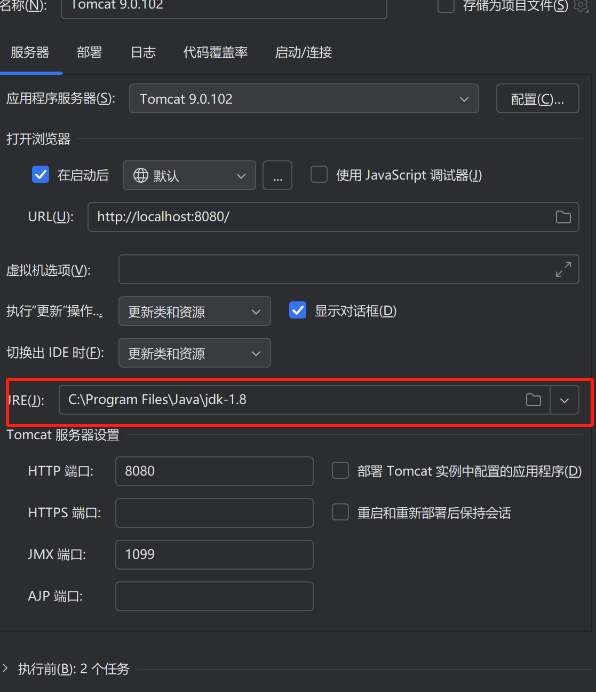

Here is the **full English translation** of your technical architecture document:

---

# Technical Architecture Document

## Technology Stack Versions

### Backend Technologies
| Component           | Version/Description                  |
|---------------------|--------------------------------------|
| JDK                 | 1.8.x (Mandatory to avoid conflicts) |
| Apache Tomcat       | 9.0.102 (Mandatory to avoid conflicts) |
| Spring Framework    | 4.3.19.RELEASE                       |
| Spring MVC          | 4.3.19.RELEASE                       |
| MyBatis             | 3.4.x/3.5.x                          |
| MySQL               | 5.7+ / 8.0                           |

### Frontend Technologies
| Technology          | Description                          |
|---------------------|--------------------------------------|
| HTML5               | Page structure                       |
| CSS3                | Styling                              |
| JavaScript          | ES5 / ES6                            |
| AJAX                | Asynchronous communication           |
| Bootstrap           | 4.x / 5.x (Responsive framework)     |

### Development Tools
| Tool                | Purpose                              | Version/Configuration Description   |
|---------------------|--------------------------------------|-------------------------------------|
| IntelliJ IDEA       | IDE for development                  | 2021.x+ (Ultimate edition)          |
| Apache Maven        | Project management                   | 3.9.9                               |
| Git                 | Version control                      | 2.x+                                |
| GitHub              | Code hosting                         | -                                   |
| Navicat             | Database management                  | Premium 15+                         |
| Apache Tomcat       | Local development server             | 9.0.102                             |

## IntelliJ IDEA - Tomcat Integration Guide

### 1. Runtime Environment Configuration
1. **Configure SDK**:
   - Go to: File → Project Structure → SDKs
   - Add path to JDK 1.8

2. **Configure Tomcat**:
   - Go to: Run → Edit Configurations
   - Click "+" → Select "Tomcat Server" → "Local"
   - Specify the installation directory for Tomcat 9.0.102
   - Set the port (default: 8080)

# Project Development Environment Configuration Standards

## 1. Required Development Tools
1. **Mandatory Tools**:
   - Main IDE: IntelliJ IDEA (recommended version 2021.3+)
   - Version Control: Git
   - Build Tool: Maven 3.9.9
   - Database Tool: Navicat Premium
   - Cache Tool: Redis Desktop Manager

## 2. Environment Configuration Steps

### 1. Tomcat Configuration Requirements
1. Go to: Edit Configurations > Tomcat Server > Local
2. In the "Deployment" tab:
   - **Application context**: Must be set to "/"
   - **Deploy at server startup**: Select the project WAR package

## Database Configuration File
Location: `TravelTribe\src\main\resources\db.properties`

## Database SQL File
Location: `TravelTribe\src\main\resources\db\migration\travel_tribe.sql`


## Tomcat



### 2. Maven配置
```xml
<!-- 必须配置的阿里云镜像（settings.xml） -->
<mirror>
  <id>aliyunmaven</id>
  <mirrorOf>*</mirrorOf>
  <name>阿里云公共仓库</name>
  <url>https://maven.aliyun.com/repository/public</url>
</mirror>
