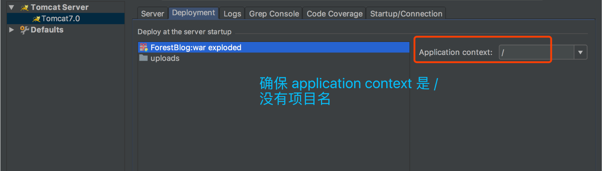

# 技术架构文档

## 技术栈版本

### 后端技术
| 组件               | 版本/说明               |
|--------------------|------------------------|
| JDK               | 1.8.x (推荐)           |
| Apache Tomcat     | 9.0.102                |
| Spring Framework  | 4.3.19.RELEASE        |
| Spring MVC        | 4.3.19.RELEASE        |
| MyBatis           | 3.4.x/3.5.x           |
| MySQL             | 5.7+/8.0              |
| Redis             | 5.x+/6.x              |

### 前端技术
| 技术              | 说明                   |
|-------------------|------------------------|
| HTML5            | 页面结构               |
| CSS3             | 样式设计               |
| JavaScript       | ES5/ES6                |
| AJAX             | 异步通信               |
| Bootstrap        | 4.x/5.x (响应式框架)   |

### 开发工具
| 工具              | 用途                   | 版本/配置说明          |
|-------------------|------------------------|-----------------------|
| IntelliJ IDEA    | 开发IDE                | 2021.x+ (Ultimate版) |
| Apache Maven     | 项目管理               | 3.9.9                |
| Git              | 版本控制               | 2.x+                 |
| GitHub           | 代码托管               | -                    |
| Navicat          | 数据库管理             | Premium 15+          |
| Apache Tomcat    | 本地开发服务器         | 9.0.102              |

## IDEA集成Tomcat配置指南

### 1. 运行环境配置
1. **配置SDK**：
   - File → Project Structure → SDKs
   - 添加JDK 1.8路径

2. **配置Tomcat**：
   - Run → Edit Configurations
   - 点击"+" → 选择Tomcat Server → Local
   - 指定Tomcat 9.0.102安装目录
   - 端口配置（默认8080）

# 项目开发环境配置规范

## 一、开发工具要求
1. **强制使用工具**：
   - 主IDE：IntelliJ IDEA（推荐2021.3+版本）
   - 版本控制：Git
   - 构建工具：Maven 3.9.9
   - 数据库工具：Navicat Premium
   - 缓存工具：Redis Desktop Manager

## 二、环境配置步骤

### 1.tomacat配置要求
1. Edit Configurations > Tomcat Server > Local
2. Deployment选项卡：
   - Application context: 必须设置为 "/"
   - Deploy at server startup: 选择项目war包



### 2. Maven配置
```xml
<!-- 必须配置的阿里云镜像（settings.xml） -->
<mirror>
  <id>aliyunmaven</id>
  <mirrorOf>*</mirrorOf>
  <name>阿里云公共仓库</name>
  <url>https://maven.aliyun.com/repository/public</url>
</mirror>